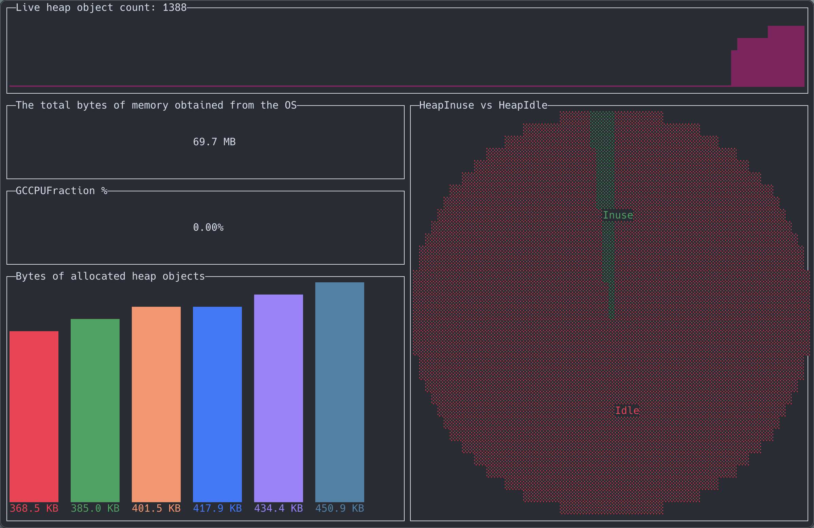

# Server Monitor

## Features
- Heap size and usage
- CPU and GC load

## Usage
### Prep
Add [expvars](https://golang.org/pkg/expvar/) to your Go server
	import _ "expvar"

### Run server monitor
	go run main.go -url=http://<HOST>/debug/vars
